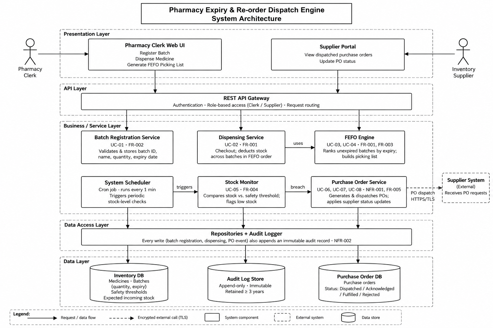

# 02 — Architectural Diagram

**Project:** Pharmacy Expiry & Re-order Dispatch Engine (Problem Statement #15)

## Files

| File | Description |
|------|-------------|
| `Architecture_Diagram.png` | System architecture diagram (image) |
| `Architecture_Diagram.pdf` | Same diagram, print-quality PDF |
| `Architecture_Diagram.drawio` | Editable source (open at [app.diagrams.net](https://app.diagrams.net)) |

## Architecture Style

The system follows a **layered architecture**, where each layer only talks to the layer directly below it.

| Layer | Components | Responsibility |
|-------|------------|----------------|
| Presentation | Pharmacy Clerk Web UI, Supplier Portal | User interaction for each actor |
| API | REST API Gateway | Authentication, role-based access, request routing |
| Business / Service | Batch Registration, Dispensing, FEFO Engine, System Scheduler, Stock Monitor, Purchase Order Service | Core business logic for all use cases |
| Data Access | Repositories + Audit Logger | Database access; writes an immutable audit record for every change |
| Data | Inventory DB, Audit Log Store, Purchase Order DB | Persistent storage |

## Key Flows

1. **Dispensing (UC-02, FR-001):** Clerk UI → API Gateway → Dispensing Service → FEFO Engine selects the earliest-expiring unexpired batch → stock deducted in Inventory DB → audit record written.
2. **Automated re-order (UC-05 → UC-06 → UC-07, FR-004, NFR-001):** System Scheduler triggers the Stock Monitor every minute → a threshold breach is passed to the Purchase Order Service → the PO is stored and dispatched to the external Supplier System over HTTPS/TLS.
3. **Supplier update (UC-08, FR-005):** Supplier Portal → API Gateway → Purchase Order Service updates the PO status and the expected incoming stock.

## Requirement Traceability

| Component | Use Case(s) | Requirement(s) |
|-----------|-------------|----------------|
| Batch Registration Service | UC-01 | FR-002 |
| Dispensing Service | UC-02 | FR-001 |
| FEFO Engine | UC-03, UC-04 | FR-001, FR-003 |
| Stock Monitor | UC-05 | FR-004 |
| Purchase Order Service | UC-06, UC-07, UC-08 | NFR-001, FR-005 |
| Audit Logger + Audit Log Store | All write operations | NFR-002 |
