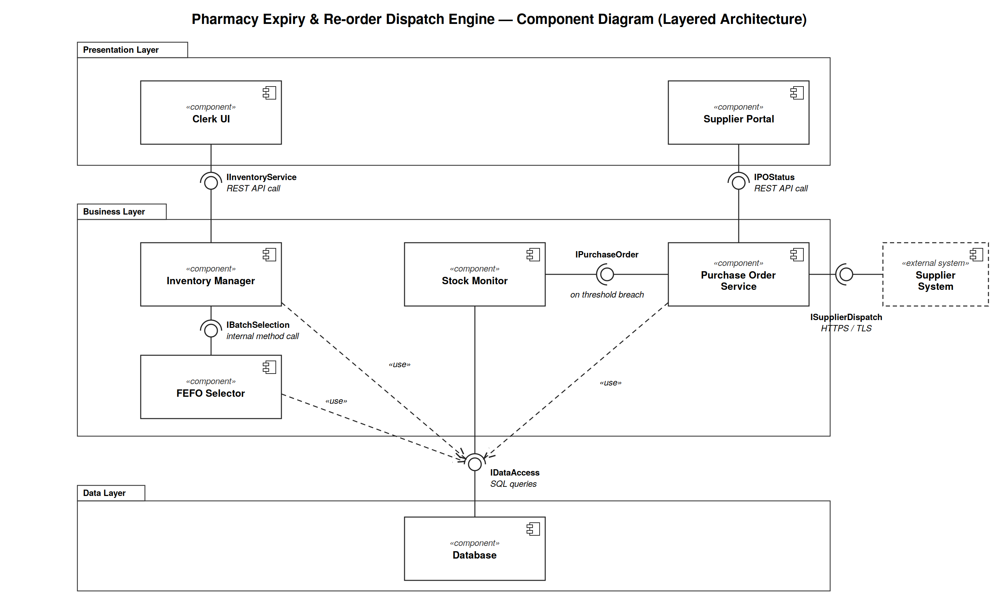

# 02 — Architectural Diagram
## Architecture Selection

**I chose Layered Architecture for the Pharmacy Expiry & Re-order Dispatch Engine.**
The full justification (two reasons, security advantage, performance benefit) is in `Architecture_Justification.pdf`.

## Component Diagram

## Files

| File | Description |
|------|-------------|
| `Component_Diagram.png` | UML component diagram with provided (ball) and required (socket) interfaces |
| `Architecture_Justification.pdf` | One-page architecture justificationn

## Components (7)

| Layer | Component | Responsibility |
|-------|-----------|----------------|
| Presentation | Clerk UI | Batch registration, dispensing, picking list screens |
| Presentation | Supplier Portal | View and update purchase order status |
| Business | Inventory Manager | Registers batches and dispenses stock (UC-01, UC-02) |
| Business | FEFO Selector | Ranks unexpired batches by expiry date (UC-03, UC-04) |
| Business | Stock Monitor | Scheduled safety-threshold checks (UC-05) |
| Business | Purchase Order Service | Generates, dispatches and updates POs (UC-06 to UC-08) |
| Data | Database | Inventory, purchase orders, append-only audit log |

## Interfaces (6)

| Interface | Provided by | Required by | Type |
|-----------|-------------|-------------|------|
| IInventoryService | Inventory Manager | Clerk UI | REST API call |
| IPOStatus | Purchase Order Service | Supplier Portal | REST API call |
| IBatchSelection | FEFO Selector | Inventory Manager | Internal method call |
| IPurchaseOrder | Purchase Order Service | Stock Monitor | Internal call on threshold breach |
| IDataAccess | Database | Inventory Manager, FEFO Selector, Stock Monitor, Purchase Order Service | SQL queries |
| ISupplierDispatch | Supplier System (external) | Purchase Order Service | HTTPS / TLS |
