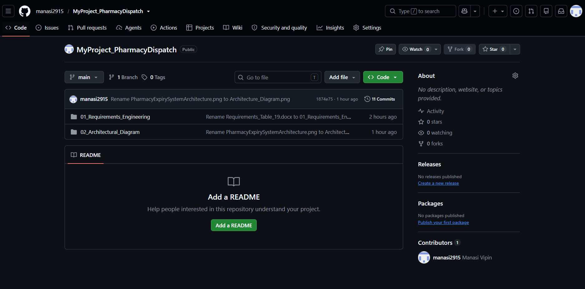
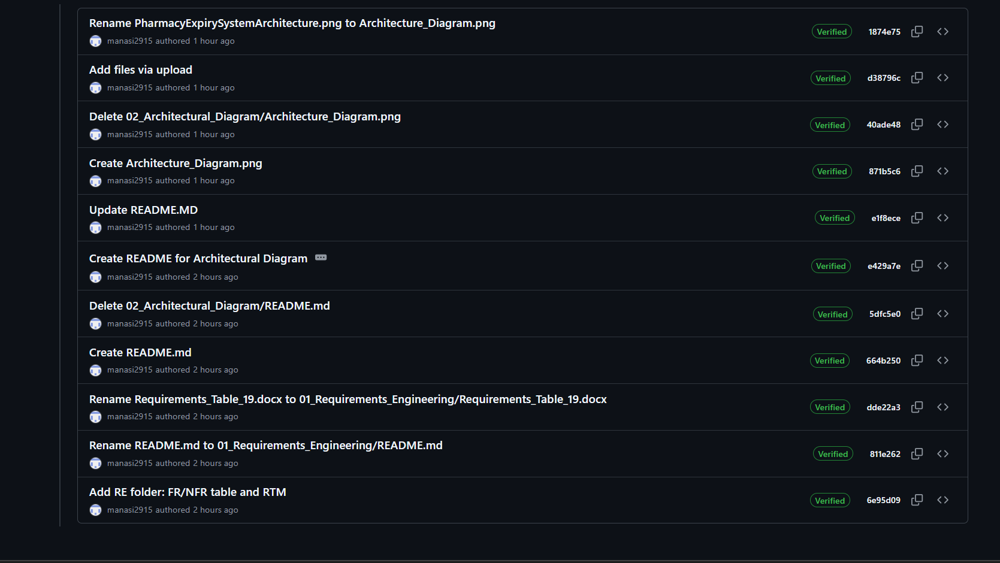
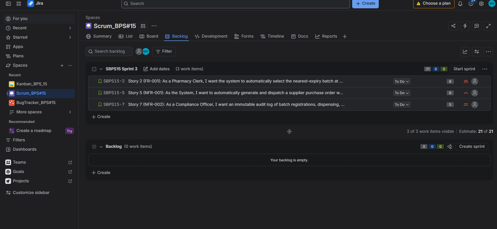
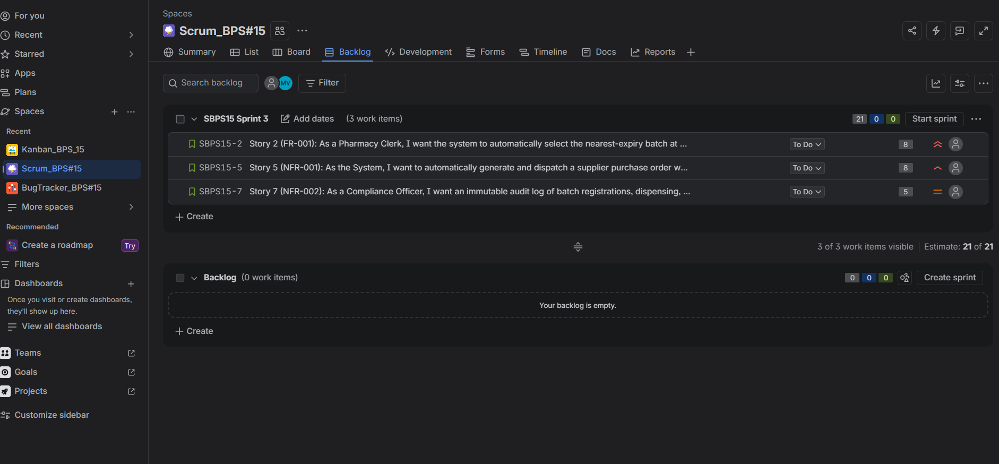
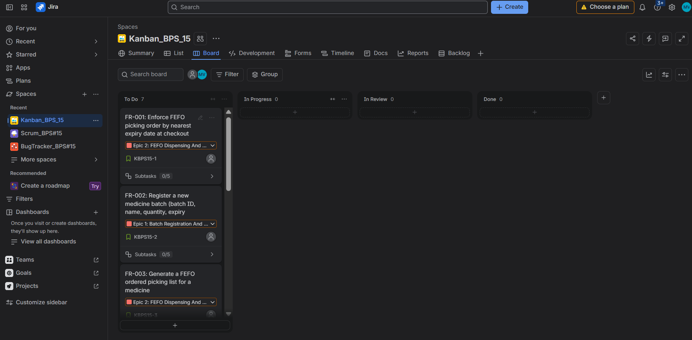
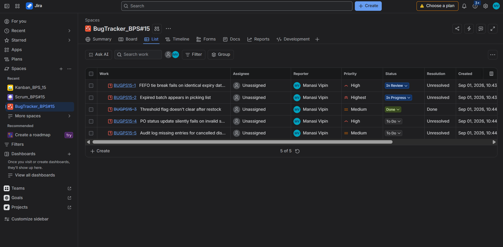
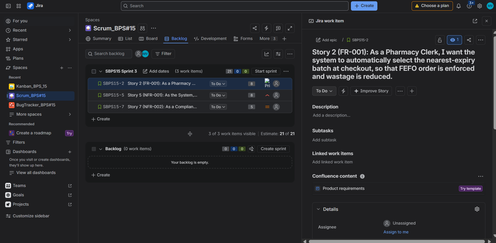

# 03 — Project Creation Screenshots (GitHub & Jira)

**Project:** Pharmacy Expiry & Re-order Dispatch Engine (Problem Statement #15)

This folder shows the project being set up on **GitHub** (repository and version control) and in **Jira** (Scrum, Kanban, and Bug Tracking projects).

---

## GitHub

### Repository created
Repository `MyProject_PharmacyDispatch`, which holds all lab deliverables.

### Commit history
Each deliverable was added in its own commit.

---

## Jira

### Projects created
Three Jira projects were created for the same system: Scrum, Kanban, and Bug Tracking.

### Scrum project: Backlog
Epics and user stories derived from the functional requirements (FR-001 to FR-005).

### Scrum project: Sprint board
Active sprint with issues moving across To Do / In Progress / Done.

### Kanban project: Board
Continuous-flow board for the same work items.

### Bug Tracking project
Bugs logged against the system, with priority and status.

### Sample issue
A user story opened in detail, showing its description and acceptance criteria.

---

## Jira Exports

| File | Description |
|------|-------------|
| `Jira_Scrum.pdf` | Scrum project export |
| `Jira_Kanban.pdf` | Kanban project export |
| `Jira_Bug_Tracking.pdf` | Bug Tracking project export |

